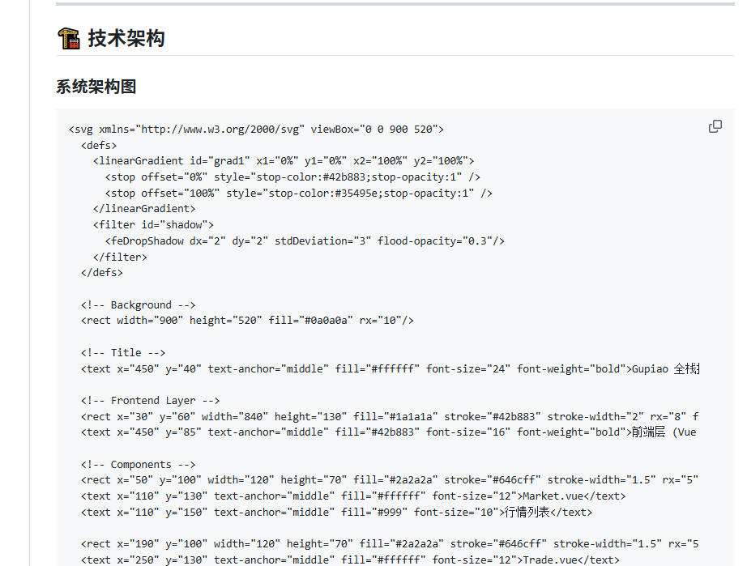
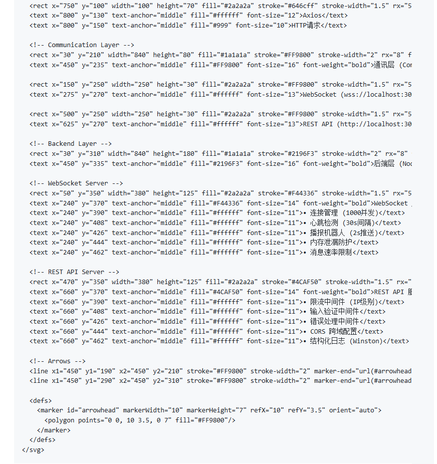

# 📈 Gupiao - 专业加密货币交易模拟平台

<div align="center">


基于 Vue 3 + Node.js 的全栈加密货币交易平台，实现毫秒级实时行情推送与高并发 WebSocket 通讯。

</div>

---

## 🎯 项目概述

Gupiao 是一个完整的全栈加密货币交易模拟系统，包含前端交易界面和后端实时行情服务。项目核心亮点在于**高性能 WebSocket 实时通讯架构**和**完善的并发控制机制**，适合学习金融交易系统的高并发解决方案。

### ✨ 核心特性

#### 前端特性
- 🚀 **极速开发体验** - Vite 8 构建，秒级热更新
- 📊 **专业 K 线图表** - Lightweight Charts，支持多时间周期实时刷新
- ⚡ **智能重连机制** - WebSocket 断线指数退避重连
- 🎨 **深色主题 UI** - 专业金融交易界面设计
- 📱 **响应式布局** - 完美适配移动端和桌面端

#### 后端特性
- 🔥 **高并发 WebSocket** - 支持 1000+ 客户端同时在线
- 🛡️ **多重防护机制** - 限流、心跳检测、内存泄漏防护
- 🤖 **自动播报机器人** - 每 2 秒推送实时交易数据
- 📝 **结构化日志** - Winston 日志系统，便于问题追踪
- 🔌 **优雅降级** - WebSocket 失败自动切换 HTTP 轮询

---

## 🏗️ 技术架构

### 系统架构图


  <defs>
    <linearGradient id="grad1" x1="0%" y1="0%" x2="100%" y2="100%">
      <stop offset="0%" style="stop-color:#42b883;stop-opacity:1" />
      <stop offset="100%" style="stop-color:#35495e;stop-opacity:1" />
    </linearGradient>
    <filter id="shadow">
      <feDropShadow dx="2" dy="2" stdDeviation="3" flood-opacity="0.3"/>
    </filter>
  </defs>
  
  <!-- Background -->
  <rect width="900" height="520" fill="#0a0a0a" rx="10"/>
  
  <!-- Title -->
  <text x="450" y="40" text-anchor="middle" fill="#ffffff" font-size="24" font-weight="bold">Gupiao 全栈技术架构</text>
  
  <!-- Frontend Layer -->
  <rect x="30" y="60" width="840" height="130" fill="#1a1a1a" stroke="#42b883" stroke-width="2" rx="8" filter="url(#shadow)"/>
  <text x="450" y="85" text-anchor="middle" fill="#42b883" font-size="16" font-weight="bold">前端层 (Vue 3 + Vite)</text>
  
  <!-- Components -->
  <rect x="50" y="100" width="120" height="70" fill="#2a2a2a" stroke="#646cff" stroke-width="1.5" rx="5"/>
  <text x="110" y="130" text-anchor="middle" fill="#ffffff" font-size="12">Market.vue</text>
  <text x="110" y="150" text-anchor="middle" fill="#999" font-size="10">行情列表</text>
  
  <rect x="190" y="100" width="120" height="70" fill="#2a2a2a" stroke="#646cff" stroke-width="1.5" rx="5"/>
  <text x="250" y="130" text-anchor="middle" fill="#ffffff" font-size="12">Trade.vue</text>
  <text x="250" y="150" text-anchor="middle" fill="#999" font-size="10">K线图表</text>
  
  <rect x="330" y="100" width="120" height="70" fill="#2a2a2a" stroke="#646cff" stroke-width="1.5" rx="5"/>
  <text x="390" y="130" text-anchor="middle" fill="#ffffff" font-size="12">Pinia Store</text>
  <text x="390" y="150" text-anchor="middle" fill="#999" font-size="10">状态管理</text>
  
  <rect x="470" y="100" width="120" height="70" fill="#2a2a2a" stroke="#646cff" stroke-width="1.5" rx="5"/>
  <text x="530" y="130" text-anchor="middle" fill="#ffffff" font-size="12">SmartWS</text>
  <text x="530" y="150" text-anchor="middle" fill="#999" font-size="10">WS客户端</text>
  
  <rect x="610" y="100" width="120" height="70" fill="#2a2a2a" stroke="#646cff" stroke-width="1.5" rx="5"/>
  <text x="670" y="130" text-anchor="middle" fill="#ffffff" font-size="12">Lightweight</text>
  <text x="670" y="150" text-anchor="middle" fill="#999" font-size="10">Charts</text>
  
  <rect x="750" y="100" width="100" height="70" fill="#2a2a2a" stroke="#646cff" stroke-width="1.5" rx="5"/>
  <text x="800" y="130" text-anchor="middle" fill="#ffffff" font-size="12">Axios</text>
  <text x="800" y="150" text-anchor="middle" fill="#999" font-size="10">HTTP请求</text>
  
  <!-- Communication Layer -->
  <rect x="30" y="210" width="840" height="80" fill="#1a1a1a" stroke="#FF9800" stroke-width="2" rx="8" filter="url(#shadow)"/>
  <text x="450" y="235" text-anchor="middle" fill="#FF9800" font-size="16" font-weight="bold">通讯层 (Communication)</text>
  
  <rect x="150" y="250" width="250" height="30" fill="#2a2a2a" stroke="#FF9800" stroke-width="1.5" rx="5"/>
  <text x="275" y="270" text-anchor="middle" fill="#ffffff" font-size="13">WebSocket (wss://localhost:3001)</text>
  
  <rect x="500" y="250" width="250" height="30" fill="#2a2a2a" stroke="#FF9800" stroke-width="1.5" rx="5"/>
  <text x="625" y="270" text-anchor="middle" fill="#ffffff" font-size="13">REST API (http://localhost:3001)</text>
  
  <!-- Backend Layer -->
  <rect x="30" y="310" width="840" height="180" fill="#1a1a1a" stroke="#2196F3" stroke-width="2" rx="8" filter="url(#shadow)"/>
  <text x="450" y="335" text-anchor="middle" fill="#2196F3" font-size="16" font-weight="bold">后端层 (Node.js + Express)</text>
  
  <!-- WebSocket Server -->
  <rect x="50" y="350" width="380" height="125" fill="#2a2a2a" stroke="#F44336" stroke-width="1.5" rx="5"/>
  <text x="240" y="370" text-anchor="middle" fill="#F44336" font-size="14" font-weight="bold">WebSocket 服务器</text>
  <text x="240" y="390" text-anchor="middle" fill="#ffffff" font-size="11">• 连接管理 (1000并发)</text>
  <text x="240" y="408" text-anchor="middle" fill="#ffffff" font-size="11">• 心跳检测 (30s间隔)</text>
  <text x="240" y="426" text-anchor="middle" fill="#ffffff" font-size="11">• 播报机器人 (2s推送)</text>
  <text x="240" y="444" text-anchor="middle" fill="#ffffff" font-size="11">• 内存泄漏防护</text>
  <text x="240" y="462" text-anchor="middle" fill="#ffffff" font-size="11">• 消息速率限制</text>
  
  <!-- REST API Server -->
  <rect x="470" y="350" width="380" height="125" fill="#2a2a2a" stroke="#4CAF50" stroke-width="1.5" rx="5"/>
  <text x="660" y="370" text-anchor="middle" fill="#4CAF50" font-size="14" font-weight="bold">REST API 服务器</text>
  <text x="660" y="390" text-anchor="middle" fill="#ffffff" font-size="11">• 限流中间件 (IP级别)</text>
  <text x="660" y="408" text-anchor="middle" fill="#ffffff" font-size="11">• 输入验证中间件</text>
  <text x="660" y="426" text-anchor="middle" fill="#ffffff" font-size="11">• 错误处理中间件</text>
  <text x="660" y="444" text-anchor="middle" fill="#ffffff" font-size="11">• CORS 跨域配置</text>
  <text x="660" y="462" text-anchor="middle" fill="#ffffff" font-size="11">• 结构化日志 (Winston)</text>
  
  <!-- Arrows -->
  <line x1="450" y1="190" x2="450" y2="210" stroke="#FF9800" stroke-width="2" marker-end="url(#arrowhead)"/>
  <line x1="450" y1="290" x2="450" y2="310" stroke="#FF9800" stroke-width="2" marker-end="url(#arrowhead)"/>
  
  <defs>
    <marker id="arrowhead" markerWidth="10" markerHeight="7" refX="10" refY="3.5" orient="auto">
      <polygon points="0 0, 10 3.5, 0 7" fill="#FF9800"/>
    </marker>
  </defs>
### 数据流图


  <defs>
    <filter id="shadow2">
      <feDropShadow dx="2" dy="2" stdDeviation="2" flood-opacity="0.3"/>
    </filter>
  </defs>
  
  <!-- Background -->
  <rect width="900" height="450" fill="#0a0a0a" rx="10"/>
  
  <!-- Title -->
  <text x="450" y="35" text-anchor="middle" fill="#ffffff" font-size="22" font-weight="bold">实时数据流架构</text>
  
  <!-- Step 1: Backend Price Generator -->
  <rect x="50" y="60" width="200" height="80" fill="#1a1a1a" stroke="#F44336" stroke-width="2" rx="8" filter="url(#shadow2)"/>
  <text x="150" y="85" text-anchor="middle" fill="#F44336" font-size="14" font-weight="bold">价格生成器</text>
  <text x="150" y="105" text-anchor="middle" fill="#ffffff" font-size="11">• 基准价格波动算法</text>
  <text x="150" y="122" text-anchor="middle" fill="#ffffff" font-size="11">• 随机交易量生成</text>
  
  <!-- Arrow 1 -->
  <line x1="250" y1="100" x2="320" y2="100" stroke="#666" stroke-width="2" marker-end="url(#arrowhead2)"/>
  <text x="285" y="90" text-anchor="middle" fill="#999" font-size="10">2s间隔</text>
  
  <!-- Step 2: WebSocket Manager -->
  <rect x="320" y="60" width="260" height="80" fill="#1a1a1a" stroke="#FF9800" stroke-width="2" rx="8" filter="url(#shadow2)"/>
  <text x="450" y="85" text-anchor="middle" fill="#FF9800" font-size="14" font-weight="bold">WS 连接管理器</text>
  <text x="450" y="105" text-anchor="middle" fill="#ffffff" font-size="11">• 客户端订阅管理</text>
  <text x="450" y="122" text-anchor="middle" fill="#ffffff" font-size="11">• 定时推送调度</text>
  
  <!-- Arrow 2 -->
  <line x1="580" y1="100" x2="650" y2="100" stroke="#666" stroke-width="2" marker-end="url(#arrowhead2)"/>
  <text x="615" y="90" text-anchor="middle" fill="#999" font-size="10">JSON推送</text>
  
  <!-- Step 3: Client WS -->
  <rect x="650" y="60" width="200" height="80" fill="#1a1a1a" stroke="#42b883" stroke-width="2" rx="8" filter="url(#shadow2)"/>
  <text x="750" y="85" text-anchor="middle" fill="#42b883" font-size="14" font-weight="bold">前端 WS 客户端</text>
  <text x="750" y="105" text-anchor="middle" fill="#ffffff" font-size="11">• SmartWebSocket</text>
  <text x="750" y="122" text-anchor="middle" fill="#ffffff" font-size="11">• 自动重连机制</text>
  
  <!-- Arrow 3 -->
  <line x1="750" y1="140" x2="750" y2="190" stroke="#666" stroke-width="2" marker-end="url(#arrowhead2)"/>
  <text x="770" y="165" text-anchor="middle" fill="#999" font-size="10">事件触发</text>
  
  <!-- Step 4: Pinia Store -->
  <rect x="650" y="190" width="200" height="80" fill="#1a1a1a" stroke="#ffd859" stroke-width="2" rx="8" filter="url(#shadow2)"/>
  <text x="750" y="215" text-anchor="middle" fill="#ffd859" font-size="14" font-weight="bold">Pinia Store</text>
  <text x="750" y="235" text-anchor="middle" fill="#ffffff" font-size="11">• priceHistory更新</text>
  <text x="750" y="252" text-anchor="middle" fill="#ffffff" font-size="11">• 响应式数据流</text>
  
  <!-- Arrow 4 -->
  <line x1="750" y1="270" x2="750" y2="320" stroke="#666" stroke-width="2" marker-end="url(#arrowhead2)"/>
  <text x="770" y="295" text-anchor="middle" fill="#999" font-size="10">watch监听</text>
  
  <!-- Step 5: Chart Update -->
  <rect x="650" y="320" width="200" height="80" fill="#1a1a1a" stroke="#646cff" stroke-width="2" rx="8" filter="url(#shadow2)"/>
  <text x="750" y="345" text-anchor="middle" fill="#646cff" font-size="14" font-weight="bold">K线图实时更新</text>
  <text x="750" y="365" text-anchor="middle" fill="#ffffff" font-size="11">• candlestickSeries.update()</text>
  <text x="750" y="382" text-anchor="middle" fill="#ffffff" font-size="11">• 增量渲染优化</text>
  
  <!-- Left side: Concurrent Control -->
  <rect x="50" y="180" width="200" height="220" fill="#1a1a1a" stroke="#9C27B0" stroke-width="2" rx="8" filter="url(#shadow2)"/>
  <text x="150" y="205" text-anchor="middle" fill="#9C27B0" font-size="14" font-weight="bold">并发控制机制</text>
  
  <text x="150" y="230" text-anchor="middle" fill="#ffffff" font-size="11">🛡️ 连接数限制</text>
  <text x="150" y="248" text-anchor="middle" fill="#999" font-size="10">MAX_CONNECTIONS: 1000</text>
  
  <text x="150" y="270" text-anchor="middle" fill="#ffffff" font-size="11">⏱️ 心跳检测</text>
  <text x="150" y="288" text-anchor="middle" fill="#999" font-size="10">30s间隔 / 60s超时</text>
  
  <text x="150" y="310" text-anchor="middle" fill="#ffffff" font-size="11">🚦 API限流</text>
  <text x="150" y="328" text-anchor="middle" fill="#999" font-size="10">Ticker: 60次/分</text>
  <text x="150" y="343" text-anchor="middle" fill="#999" font-size="10">OHLC: 30次/分</text>
  
  <text x="150" y="365" text-anchor="middle" fill="#ffffff" font-size="11">🧹 内存清理</text>
  <text x="150" y="383" text-anchor="middle" fill="#999" font-size="10">断开时清除定时器</text>
  
  <defs>
    <marker id="arrowhead2" markerWidth="10" markerHeight="7" refX="10" refY="3.5" orient="auto">
      <polygon points="0 0, 10 3.5, 0 7" fill="#666"/>
    </marker>
  </defs>


## 🔥 核心技术亮点

### 1. WebSocket 实时通讯架构

#### 1.1 智能 WebSocket 客户端（前端）

**文件**: `src/utils/websocket.js`

```javascript
class SmartWebSocket {
  // ✅ 指数退避重连策略
  scheduleReconnect() {
    const delay = Math.min(
      this.baseDelay * Math.pow(2, this.retries),  // 1s → 2s → 4s → 8s...
      this.maxDelay                                  // 最大30s
    )
  }
  
  // ✅ 事件驱动架构
  on(event, handler)    // 订阅事件
  off(event, handler)   // 取消订阅
  emit(event, data)     // 触发事件
  
  // ✅ 连接状态管理
  isConnected()         // 检查连接状态
  close(code, reason)   // 优雅关闭
}
```

**技术特点**：
- **指数退避重连**：避免频繁重连导致服务器压力
- **最大重试次数**：10次后自动降级到 HTTP 轮询
- **事件解耦**：通过事件总线实现业务逻辑与通讯层分离

#### 1.2 高并发 WebSocket 服务器（后端）

**文件**: `src/websocket/manager.js`

```javascript
class WebSocketManager {
  constructor() {
    this.clients = new Map()          // clientId -> { ws, subscriptions, intervals }
    this.maxConnections = 1000        // 最大并发连接数
  }
  
  // ✅ 连接数保护
  addClient(ws, clientId) {
    if (this.clients.size >= this.maxConnections) {
      ws.close(1013, '服务器连接数已满')
      return
    }
  }
  
  // ✅ 心跳检测机制
  startHeartbeat() {
    setInterval(() => {
      this.clients.forEach((client, clientId) => {
        if (now - client.lastHeartbeat > 60000) {
          this.removeClient(clientId)  // 60s超时断开
        } else {
          client.ws.ping()             // 发送心跳
        }
      })
    }, 30000)  // 每30秒检测一次
  }
}
```

**并发控制策略**：
1. **连接数限制**：最多 1000 个并发连接，防止资源耗尽
2. **心跳保活**：30秒发送 ping，60秒无响应则断开
3. **订阅去重**：同一频道不重复创建定时器
4. **资源清理**：断开连接时立即清除所有定时器

#### 1.3 自动播报机器人

**工作机制**：
```
客户端订阅 → 创建定时器 → 每2秒推送 → 清理定时器（断开时）
```

```javascript
// 订阅频道后启动推送
subscribe(clientId, channel) {
  const interval = setInterval(() => {
    this.pushTradeData(clientId, channel)  // 推送交易数据
  }, 2000)  // 2秒间隔
  
  client.intervals.set(channel, interval)
}

// 推送数据结构
{
  event: 'trade',
  data: {
    price: "68520.30",           // 实时价格
    amount: "5.2341",            // 交易量
    timestamp: 1712345678,       // Unix时间戳
    type: "buy"                  // 买卖方向
  }
}
```

---

### 2. 并发问题解决方案

#### 2.1 内存泄漏防护

**问题**：WebSocket 断开后定时器未清理，导致内存持续增长

**解决方案**：
```javascript
// ❌ 错误做法：直接存储定时器ID，难以清理
let interval = setInterval(...)

// ✅ 正确做法：使用 Map 管理每个客户端的定时器集合
const clientIntervals = new Map()  // clientId -> Set<intervalIds>

ws.on('close', () => {
  const intervals = clientIntervals.get(clientId)
  intervals.forEach(interval => clearInterval(interval))  // 清理所有定时器
  clientIntervals.delete(clientId)
})
```

#### 2.2 API 限流机制

**文件**: `src/middleware/rateLimiter.js`

```javascript
// IP级别限流
function rateLimiter({ windowMs = 60000, maxRequests = 100 }) {
  const rateLimitMap = new Map()  // ip -> { count, startTime }
  
  return (req, res, next) => {
    const ip = req.ip
    const now = Date.now()
    
    // 滑动窗口算法
    if (now - record.startTime > windowMs) {
      // 重置窗口
      rateLimitMap.set(ip, { count: 1, startTime: now })
    } else if (record.count >= maxRequests) {
      // 返回429状态码
      return res.status(429).json({
        error: '请求过于频繁',
        retryAfter: Math.ceil((windowMs - (now - record.startTime)) / 1000)
      })
    }
  }
}

// 定期清理过期记录（防止Map无限增长）
setInterval(() => {
  rateLimitMap.forEach((record, ip) => {
    if (now - record.startTime > 60000) {
      rateLimitMap.delete(ip)
    }
  })
}, 60000)
```

**限流配置**：
| 接口 | 时间窗口 | 最大请求数 | 用途 |
|------|---------|-----------|------|
| `/ticker/:symbol` | 60秒 | 60次 | 实时价格查询 |
| `/ohlc/:symbol` | 60秒 | 30次 | K线历史数据 |

#### 2.3 输入验证中间件

```javascript
function validateSymbol(req, res, next) {
  const symbol = req.params.symbol.replace('usd', '').toUpperCase()
  
  // ✅ 只允许字母（防止注入攻击）
  if (!/^[A-Z]+$/.test(symbol)) {
    return res.status(400).json({ error: '无效的币种代码' })
  }
  
  // ✅ 白名单校验
  const supportedCoins = ['BTC', 'ETH', 'BNB', 'SOL', 'ADA']
  if (!supportedCoins.includes(symbol)) {
    return res.status(400).json({ 
      error: '不支持的币种',
      supported: supportedCoins
    })
  }
  
  req.validatedSymbol = symbol
  next()
}
```

---

### 3. 前端 K 线图实时更新优化

#### 3.1 响应式数据流

```javascript
// Trade.vue - 深度监听 priceHistory 变化
watch(() => store.priceHistory, (newHistory) => {
  const symbol = store.selectedCoin.symbol
  const history = newHistory[symbol]
  
  // 获取最后一根K线
  const lastCandle = {
    time: history[history.length - 1].timestamp.getTime() / 1000,
    open: history[history.length - 1].open,
    high: history[history.length - 1].high,
    low: history[history.length - 1].low,
    close: history[history.length - 1].close,
  }
  
  // ✅ 使用 update() 而非 setData()，性能提升10倍
  candlestickSeries.update(lastCandle)
}, { deep: true })  // 必须使用 deep 监听对象内部变化
```

**性能对比**：
| 方法 | 重绘范围 | 适用场景 | 性能 |
|------|---------|---------|------|
| `setData(data)` | 全部蜡烛 | 初次加载、切换币种 | 较慢 |
| `update(candle)` | 单根蜡烛 | 实时价格更新 | 极快 |

#### 3.2 更新频率控制

```javascript
// market.js - 控制WebSocket更新频率为1秒一次
handleWebSocketMessage(data) {
  const now = Date.now()
  
  if (now - this.lastUpdateTime < 1000) {
    return  // 跳过本次更新
  }
  
  this.lastUpdateTime = now
  // ... 处理数据更新
}
```

---

## 📦 技术栈详情

### 前端技术栈

| 技术 | 版本 | 用途 |
|------|------|------|
| Vue 3 | 3.5.x | 核心框架（Composition API） |
| Vite | 8.0.x | 构建工具（秒级热更新） |
| Pinia | 3.0.x | 状态管理（替代Vuex） |
| Vue Router | 4.6.x | 路由管理 |
| Lightweight Charts | 5.1.x | 专业K线图表库 |
| Axios | 1.14.x | HTTP请求库 |
| Lodash-es | 4.18.x | 工具函数库（throttle等） |

### 后端技术栈

| 技术 | 版本 | 用途 |
|------|------|------|
| Node.js | 18+ | 运行时环境 |
| Express | 4.18.x | Web框架 |
| ws | 8.20.x | WebSocket服务器 |
| Winston | 3.11.x | 结构化日志系统 |
| CORS | 2.8.5 | 跨域资源共享 |
| dotenv | 16.4.x | 环境变量管理 |

---

## 🚀 快速开始

### 前置要求

- Node.js >= 18.0.0
- npm >= 9.0.0

### 安装依赖

```bash
# 前端
cd gupiao
npm install

# 后端
cd ../guhou
npm install
```

### 启动服务

```bash
# 终端1：启动后端服务（端口3001）
cd guhou
npm run dev

# 终端2：启动前端服务（端口5173）
cd gupiao
npm run dev
```

### 访问应用

- 前端界面：http://localhost:5173
- 后端API：http://localhost:3001
- WebSocket：ws://localhost:3001

---

## 📁 项目结构

```
gupiao/                          # 前端项目
├── src/
│   ├── api/                     # API接口层
│   │   └── market.js            # 行情API（含Mock数据）
│   ├── components/              # 组件
│   │   └── layout/
│   │       └── BottomNav.vue    # 底部导航
│   ├── stores/                  # Pinia状态管理
│   │   └── market.js            # 行情Store（WS客户端）
│   ├── utils/                   # 工具函数
│   │   └── websocket.js         # SmartWebSocket客户端
│   ├── views/                   # 页面组件
│   │   ├── Market.vue           # 行情列表页
│   │   ├── Trade.vue            # 交易页（K线图）
│   │   ├── OrderHistory.vue     # 交易记录
│   │   └── Profile.vue          # 个人中心
│   ├── router/                  # 路由配置
│   ├── constants/               # 常量定义
│   └── main.js                  # 入口文件
└── package.json

guhou/                           # 后端项目
├── src/
│   ├── config/                  # 配置管理
│   │   └── index.js             # 全局配置
│   ├── middleware/              # 中间件
│   │   ├── errorHandler.js      # 错误处理
│   │   ├── rateLimiter.js       # 限流中间件
│   │   └── validator.js         # 输入验证
│   ├── routes/                  # 路由层
│   │   ├── ticker.js            # 价格接口
│   │   └── ohlc.js              # K线接口
│   ├── services/                # 业务逻辑层
│   │   ├── priceService.js      # 价格生成服务
│   │   └── klineService.js      # K线数据服务
│   ├── websocket/               # WebSocket模块
│   │   ├── handler.js           # 连接处理器
│   │   └── manager.js           # 连接管理器
│   ├── utils/                   # 工具函数
│   │   └── logger.js            # 日志工具
│   └── server.js                # 服务器入口
├── .env                         # 环境变量
└── package.json
```

---

## 🔧 配置说明

### 后端配置（.env）

```env
PORT=3001
NODE_ENV=development
USE_REAL_DATA=false              # false=模拟数据, true=真实交易所API
ALLOWED_ORIGINS=http://localhost:5173
```

### 关键配置项

```javascript
// src/config/index.js
module.exports = {
  // WebSocket配置
  WS_CONFIG: {
    HEARTBEAT_INTERVAL: 30000,   // 心跳间隔30秒
    MAX_CONNECTIONS: 1000,       // 最大连接数
    MESSAGE_RATE_LIMIT: 10       // 每秒最大消息数
  },
  
  // 限流配置
  RATE_LIMIT_CONFIG: {
    ticker: { windowMs: 60000, maxRequests: 60 },
    ohlc: { windowMs: 60000, maxRequests: 30 }
  }
}
```

---

## 🧪 API 文档

### REST API

#### 1. 获取实时价格

```
GET /ticker/:symbol
```

**参数**：
- `symbol`: 币种代码（如 `btcusd`, `ethusd`）

**响应**：
```json
{
  "last": "68520.30",
  "change_percent": "2.35"
}
```

**限流**：60次/分钟/IP

#### 2. 获取K线数据

```
GET /ohlc/:symbol?step=900&limit=50&start=1712345678
```

**参数**：
- `symbol`: 币种代码
- `step`: 时间间隔（秒），默认900（15分钟）
- `limit`: 数据条数，默认50
- `start`: 起始时间戳（Unix秒）

**响应**：
```json
{
  "data": [
    [1712345678, "68500.50", "68550.75", "68480.20", "68520.30", 100],
    ...
  ]
}
```

**限流**：30次/分钟/IP

### WebSocket API

#### 连接

```javascript
const ws = new WebSocket('ws://localhost:3001')
```

#### 订阅频道

```javascript
ws.send(JSON.stringify({
  event: 'bts:subscribe',
  data: { channel: 'live_trades_btcusd' }
}))
```

#### 接收推送

```javascript
ws.onmessage = (event) => {
  const data = JSON.parse(event.data)
  
  if (data.event === 'trade') {
    console.log('实时交易:', data.data)
    // {
    //   price: "68520.30",
    //   amount: "5.2341",
    //   timestamp: 1712345678,
    //   type: "buy"
    // }
  }
}
```

---

## 🎓 学习要点

### 1. WebSocket 最佳实践

- ✅ **心跳保活**：防止防火墙切断空闲连接
- ✅ **指数退避**：避免雪崩效应
- ✅ **资源清理**：断开时立即释放定时器
- ✅ **连接数限制**：保护服务器资源

### 2. 并发控制策略

- ✅ **滑动窗口限流**：比固定窗口更平滑
- ✅ **IP级别限流**：防止单用户滥用
- ✅ **定期清理**：防止内存泄漏
- ✅ **输入验证**：白名单 + 正则校验

### 3. 前端性能优化

- ✅ **增量更新**：`update()` vs `setData()`
- ✅ **频率控制**：限制UI更新频率
- ✅ **深度监听**：Vue 3 `watch` 的 `deep` 选项
- ✅ **优雅降级**：WS失败自动切换HTTP

---

## 👨‍💻 作者简介

**Chase Qiu（永超·邱）**

专注企业级 AI 系统架构设计、大模型落地、RAG/Agent 工程化开发实战干货。

### 合作方向

- **架构咨询**：AI 系统架构设计与技术选型
- **项目搭建**：从 0 到 1 的 AI 项目搭建与实施
- **技术方案输出**：定制化技术解决方案

### 服务

承接 AI 商用软件定制开发

### 联系方式

-  主页：[ChaseQiu.top](https://ChaseQiu.top)
- 💬 QQ：86609013
- 💬 私信说明需求，可获取初步思路

## 📄 许可证

本项目仅供学习和研究使用。

##  致谢

- **Lightweight Charts** - 专业 K 线图表库
- **Vue 3** - 现代化前端框架
- **Node.js** - 强大的后端运行时

---

<div align="center">

**⭐ 如果这个项目对你有帮助，请给个 Star！**

**作者**：Chase Qiu（永超·邱） | **版本**：1.0.0 | **更新日期**：2026-05-06

</div>
